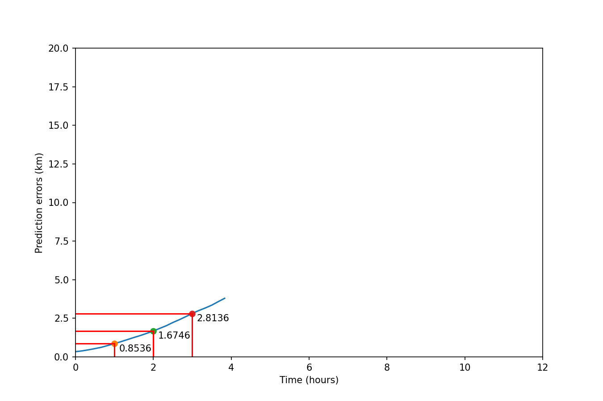

# TrAISformer

Pytorch implementation of TrAISformer---A generative transformer for AIS trajectory prediction (https://arxiv.org/abs/2109.03958).

The transformer part is adapted from: https://github.com/karpathy/minGPT

---

  

#### Requirements: 
See requirements.yml

### Datasets:

The data used in this paper are provided by the [Danish Maritime Authority (DMA)](https://dma.dk/safety-at-sea/navigational-information/ais-data). 
Please refer to [the paper](https://arxiv.org/abs/2109.03958) for the details of the pre-processing step. The code is available here: https://github.com/CIA-Oceanix/GeoTrackNet/blob/master/data/csv2pkl.py

A processed dataset can be found in `./data/ct_dma/`
(the format is `[lat, log, sog, cog, unix_timestamp, mmsi]`).

### Run

Run `trAISformer.py` to train and evaluate the model.
(Please note that the values given by the code are in km, while the values presented in the paper were converted to nautical mile.)

### License

See `LICENSE`

### Contact
For any questions, please open an issue and assign it to @dnguyengithub.

# trAISformer
